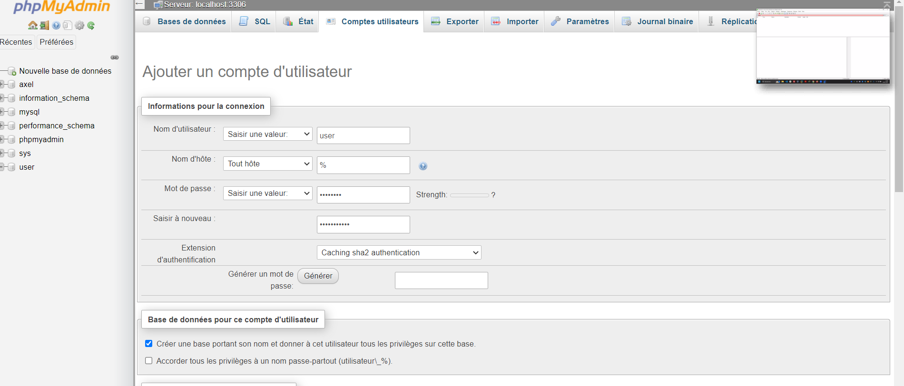
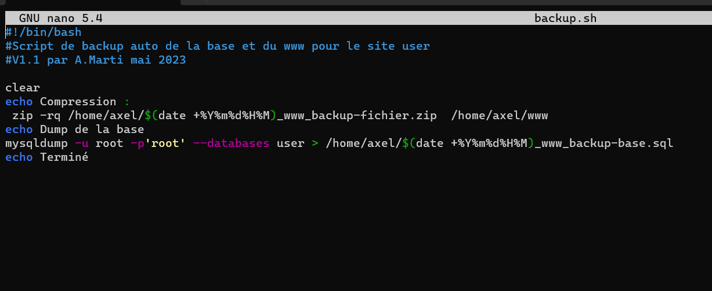
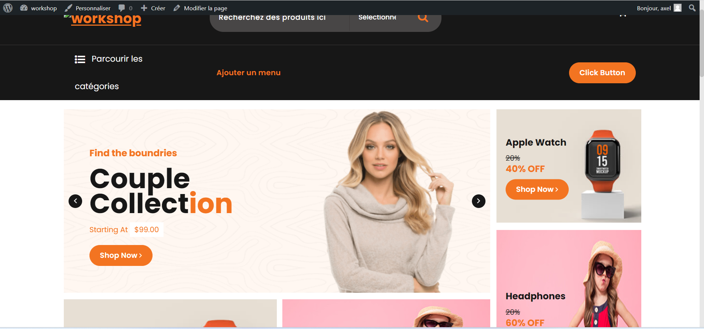

# Présentation, installation et paramétrage d'un serveur LAMP / Wordpress
## Architecture client Serveur N-Tiers  

## Baseline Debian
### modification bashrc root 
**cd /root**  
**nano .bashrc**

### modification ip fixe plus nommage machine et domaine
### installation des utilitaires usuels du système 
**apt install nmap zip dnsutils net-tools tzdata lynx ssh sudo curl git screen**  
### installation Webadmin 
**wget https://github.com/webmin/webmin/releases/download/2.021/webmin_2.021_all.deb**  
**dpkg -i webmin_2.021_all.deb** puis  
**apt -f install**
## Installation et Configuration d'Apache2
### installation d'apache 2.4
**apt install apache2**
### activation du module SSL
**a2enmod ssl**
**a2ensite default-ssl**  
relancer le service ( systemctl restart apache2)  
 **systemectl restart apache2**  
  génération du certificat auto signé pour 10 ans , pensez à bien mettre votre FQDN en CN dans la même idée veillez à avoir une bonne concordance de nom dans hostname,hosts et resolv.conf   
  **openssl req $@ -new -x509 -days 3650 -nodes -out /etc/apache2/apache.pem -keyout /etc/apache2/apache.pem**  
   ### activation des modules populaires
**a2enmod rewrite**  
**a2enmod headers**  
### création en mode user du dossier www et d’un index dans /home/user/ 
 débrayage temporaire en mode user pour la création  
 **su user**  
 **mkdir /home/user/www**  
 **nano /home/user/www/index.html**  
 créer du contenu pipo dans votre index (Welcome)  
 **su -**  
 de retour en root  
 Ce chemin sert de directory au service apache  
## Fusion des deux fichiers de configuration par defaut de appache  
fusion des 2 fichiers de conf, copier le contenu des 2 fichiers de conf (000 et default ssl) dans un seul fichier dans sites-available nommé site.conf  
**cd /etc/apache2/sites-available**  
**cat 000-default.conf >site.conf**  
**cat default-ssl.conf >>site.conf**  
désactivation des 2 fichiers de conf qui ne vont plus servir  
**a2dissite 000-default**  
**a2dissite default-ssl**  
effacement de ces 2 fichiers  
**rm 000-default.conf**  
**rm default-ssl.conf**  
activation de la nouvelle et unique conf  
**a2ensite site.conf**  
**service apache2 restart**  
La configuration du fichier site.conf doit ce composer comme ceci.

## Installation et configuration de la base de données
### installation de mysql8   
**wget https://repo.mysql.com/mysql-apt-config_0.8.23-1_all.deb**  
**dpkg -i mysql-apt-config_0.8.23-1_all.deb**  
**apt update**  
**apt upgrade**  
**apt install mysql-server**
### test de mysql
**mysql -u root -p**

## Installation et configuration du langage PHP7.X  
apt install php
### édition du fichier php.ini pour modifier le upload max  
**nano /etc/php/7.4/apache2/php.ini** 
  
**systemctl restart apache2**
### création d’un fichier test dans /home/user/www/
nommé test.php avec le compte user  
**su user**  
**nano /home/user/www/test.php** 

### lancer un navigateur sur https://votreFQDN/test.php  

### installation des libs php souvent utilisées par les cms
**apt install  php-mysql php-curl php-gd php-zip php-apcu php-xml php-ldap php-mbstring**  
**systemectl restart apache2**
## Installation et configuration de PhpMyAdmin
**apt install phpmyadmin**  
  
Changement des droits root avec %  

Création via PMA dans MYSQL d'un utilisateur USER qui sur la base USER aura tous les droits sur ca propre base.  
Recharger les privileges(droits) via une fenêtre SQL en haut et taper la commande:  
**Flush privileges;** 
## Bonus
### Installation et configuration du service FTP
**apt install vsftpd**  
**cp /etc/vsftpd.conf /etc/vsftpd.bak**  
**rm /etc/vsftpd.conf**  
**nano /etc/vsftpd.conf**  
Exemple :   
  listen=NO  
  listen_ipv6=YES  
  local_enable=YES  
   write_enable=YES  
   local_umask=022  
   dirmessage_enable=YES  
   use_localtime=YES  
   xferlog_enable=YES  
connect_from_port_20=YES  
chroot_local_user=YES  
allow_writeable_chroot=YES  
secure_chroot_dir=/var/run/vsftpd/empty  
pam_service_name=vsftpd  
rsa_cert_file=/etc/apache2/apache.pem  
rsa_private_key_file=/etc/apache2/apache.pem  
ssl_enable=YES  
pasv_enable=yes  
pasv_min_port=65000  
pasv_max_port=65500   
ftpd_banner=David Banner  
**systemectl restart vsftpd**  
**nmap 127.0.0.1** 
**nmap ip.host**  
**systemectl status vsftpd**  
se connecter en ftps avec filezilla client
### Installation et configuration du partage SAMBA     
**apt install samba**
**mv /etc/samba/smb.conf /etc/samba/smb.bak**  
**nano /etc/samba/smb.conf**
### Config samba  
[global]
workgroup = TSSR  
netbios name = www  
comment = Serveur de fichier de thomas pour le lamps  
interfaces = ens33  
encrypt passwords = true  
security = user  
smb passwd file = /usr/bin/smbpasswd  
passdb backend = tdbsam  
obey pam restrictions = yes

[www]  
path = /home/user/www  
valid users = user  
writeable = Yes  
create mask = 777  
directory mask = 777    

    relancer les 2 services  
**service restart nmbd**  
**service restart smbd**    
tester notre fichier de conf  
**testparm**  
chiffrer le user de la base de compte local Linux à la sauce windows  
**smbpasswd -a user**  
il n' y a plus qu'à tester via l'explorateur de fichier 

\\\votreip\www ou \\\votrenomnetbios\www ou \\\votrefqdn\www

### Script de sauvegarde des bases de données
**cd /root**  
**touch backup.sh**  
**chmod +x backup.sh**  
**nano backup.sh**
  
Tester le script  
**cd /root**  
**./backup.sh**  
Automatiser le script via le crontab    
**crontab -e**  
ajouter la ligne   
***/5 * * * * /root/backup.sh** ce qui corespond à toutes les 5min
## Installation de Wordpress   
**cd /home/user**   
**rm -R /home/user/www**  
**wget https://fr.wordpress.org/latest-fr_FR.zip**  
**unzip latest-fr_FR.zip**  
**mv wordpress www**  
**chown -R www-data:www-data /home/user/www**  
**chmod -R 775 /home/user/www**  
### Terminer l'installation de Wordpress par votre navigateur!  
Ce qui vous permet de customiser et gerer un site internet via des templates et une console d'administration.  
Exemple en vogue site ecommerce :  via http://www.infra.lan

